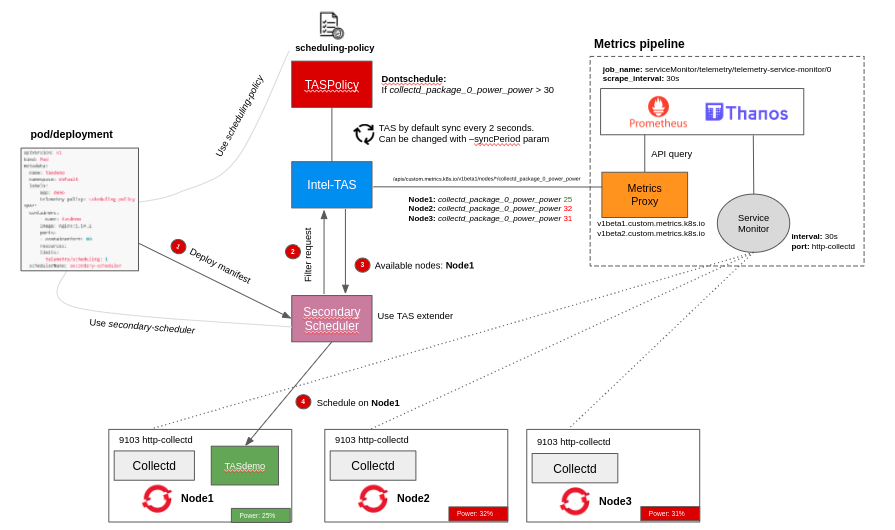

# Intel-TAS (Telemetry Aware Scheduling) on Red Hat OpenShift Container Platform

The Intel-TAS is an extender of the default K8S scheduler that consumes "platform" metrics and makes intelligent scheduling/descheduling decisions based on defined policies. 

Example use cases:

- Sustainability awareness for workload placement (power, temperature, weather etc..)
- Guarante SLAs for example a Network Slice (throughput, packets loss, latency)
- Workload placement on ML models (holistic network/apps view)

Review the following documentation from Intel on how to configure the TAS policies:

- [Telemetry Aware Scheduling whitepaper](https://builders.intel.com/docs/networkbuilders/telemetry-aware-scheduling-automated-workload-optimization-with-kubernetes-k8s-technology-guide.pdf)
- Official [Intel-TAS repo](https://github.com/intel/platform-aware-scheduling/tree/master/telemetry-aware-scheduling)

This repository provides the instructions to run Intel-TAS on Red Hat OpenShift Container Platform.


## Table of Contents

<!-- TOC -->

- [Architecture](#architecture)
- [Overview](#overview)
- [Activate User Workload Monitoring](#activate-user-workload-monitoring)
- [Install Collectd Chart](#install-collectd-chart) 
- [Deploy Metrics Proxy](#deploy-metrics-proxy)
- [Deploy Secondary Scheduler Operator](#deploy-secondary-scheduler-operator)
- [Deploy Intel-TAS](#deploy-intel-tas)
- [Challenges](#challenges)

<!-- TOC -->

## Architecture



> NOTE: OpenShift already comes with an extensive list of platform metrics available such as temperature, network, cpu, memory  etc.. Collectd allows you more flexibility in customization because you can load additional [plugins](https://collectd.org/wiki/index.php/Table_of_Plugins) as needed.

> NOTE: In this case I have 3 baremetal nodes, if you try to run on a VMs based cluster `intel-rapl` (Running Average Power Limit) is not available and you will hit the following error on the collectd container:

```
[2022-08-02 15:39:18] [error] Unhandled python exception in loading module: OSError: [Errno 2] No such file or directory: '/sys/devices/virtual/powercap/intel-rapl/intel-rapl:0/max_energy_range_uj'
Could not read power consumption wraparound value
```

## Overview

Steps to get the Intel-TAS working on OpenShift:

1. Activate UWM (User Workload Monitoring) in OpenShift.
   - Creates a Thanos instance for user metrics 
2. Install collectd helm chart to monitor power and other platform metrics.
   - Deploy SCC (SecurityContextConstraints)
   - Create `telemetry` namespace and label it
   - Custom image that includes pkgpower.py, typesdb and events required by Intel collectd plugins
   - Daemonset and ServiceMonitor, RBAC for prometheus to scrape on the `telemetry` namespace
4. Deploy Custom Metrics Proxy.
   - Important to set correctly the PROMETHEUS variables in deployment.yaml
5. Deploy Intel-TAS using the helm charts
   - Use helm chart from Intel Experience Container Kit
6. Deploy Secondary Scheduler Operator
   - Check the OpenShift version for correct procedure
7. Test the setup.

## Activate User Workload Monitoring

Enable monitoring for user-defined projects in addition to the default platform monitoring provided by OpenShift.

Apply enable_user_workload.yaml

```
# oc create -f enable_user_workload.yaml
```

Check `prometheus-user-workload` pods are created under `openshift-user-workload-monitoring` namespace.

```
# oc get pods -n openshift-user-workload-monitoring
NAME                                  READY   STATUS    RESTARTS   AGE
prometheus-operator-594b5c8b9-2sj4d   2/2     Running   0          38d
prometheus-user-workload-0            5/5     Running   1          38d
prometheus-user-workload-1            5/5     Running   1          38d
thanos-ruler-user-workload-0          3/3     Running   0          38d
thanos-ruler-user-workload-1          3/3     Running   0          38d
```

Create an empty config:

```
# oc apply -f user_workload_config.yaml
```

```yaml
apiVersion: v1
kind: ConfigMap
metadata:
  name: user-workload-monitoring-config
  namespace: openshift-user-workload-monitoring
data:
  config.yaml: |
```

Verify configuration is loaded successfully:

```
# oc logs prometheus-user-workload-0 -n openshift-user-workload-monitoring | grep config
level=info ts=2022-06-12T21:16:51.704Z caller=main.go:975 msg="Completed loading of configuration file" filename=/etc/prometheus/config_out/prometheus.env.yaml totalDuration=19.732179ms remote_storage=3.67µs web_handler=1.03µs query_engine=1.574µs scrape=3.926427ms scrape_sd=6.437638ms notify=269.528µs notify_sd=3.159647ms rules=71.163µs
```

## Install collectd Chart

Create `telemetry` namespace and add label required by user-workload-monitoring.

```
# oc create ns telemetry
# oc label namespace telemetry openshift.io/cluster-monitoring=true
```

Apply SCC collectd_scc.yaml

```
# oc create -f collectd/collectd_scc.yaml
```

Install helm chart

```
# cd collectd_chart/
# helm install telemetry -n telemetry .

NAME: telemetry
LAST DEPLOYED: Wed Jul 20 13:26:20 2022
NAMESPACE: telemetry
STATUS: deployed
REVISION: 1
TEST SUITE: None
NOTES:
Installing collectd.

The release is named telemetry.

To use the helm release:

  $ helm status telemetry
  $ helm get all telemetry
```

Verify pods are running:

```
# oc get pods -n telemetry
NAME             READY   STATUS    RESTARTS   AGE
collectd-bqcgd   2/2     Running   0          35s
collectd-q5m74   2/2     Running   0          35s
collectd-xzhtt   2/2     Running   0          35s

# oc logs -f collectd-bqcgd -n telemetry
[2022-06-12 22:31:47] plugin_load: plugin "logfile" successfully loaded.
[2022-06-12 22:31:47] logfile: invalid loglevel [debug] defaulting to 'info'
[2022-06-12 22:31:47] [info] plugin_load: plugin "cpu" successfully loaded.
[2022-06-12 22:31:47] [info] plugin_load: plugin "interface" successfully loaded.
[2022-06-12 22:31:47] [info] plugin_load: plugin "load" successfully loaded.
[2022-06-12 22:31:47] [info] plugin_load: plugin "memory" successfully loaded.
[2022-06-12 22:31:47] [info] plugin_load: plugin "syslog" successfully loaded.
[2022-06-12 22:31:47] [info] plugin_load: plugin "network" successfully loaded.
[2022-06-12 22:31:47] [info] plugin_load: plugin "write_prometheus" successfully loaded.
[2022-06-12 22:31:47] [info] plugin_load: plugin "hugepages" successfully loaded.
[2022-06-12 22:31:47] [info] plugin_load: plugin "intel_pmu" successfully loaded.
[2022-06-12 22:31:47] [info] plugin_load: plugin "ipmi" successfully loaded.
[2022-06-12 22:31:47] [info] plugin_load: plugin "python" successfully loaded.
[2022-06-12 22:31:47] [info] write_prometheus plugin: Listening on [::]:9103.
....
....
```

Collectd runs as a daemonset, we now have an instance on each node. Verify metrics are available to scrape with the ServiceMonitor by curl the prometheus exporter plugin configured in collectd.

```
# oc get nodes
NAME                         STATUS   ROLES           AGE    VERSION
node7.ocp4rony.dfw.ocp.run   Ready    master,worker   257d   v1.21.1+a620f50
node8.ocp4rony.dfw.ocp.run   Ready    master,worker   257d   v1.21.1+a620f50
node9.ocp4rony.dfw.ocp.run   Ready    master,worker   257d   v1.21.1+a620f50

# curl http://node7.ocp4rony.dfw.ocp.run:9103
# TYPE collectd_memory gauge
collectd_memory{memory="buffered",instance="node7.ocp4rony.dfw.ocp.run"} 1308160000 1658342947277
collectd_memory{memory="cached",instance="node7.ocp4rony.dfw.ocp.run"} 21941870592 1658342947277
collectd_memory{memory="free",instance="node7.ocp4rony.dfw.ocp.run"} 1341911040 1658342947277
collectd_memory{memory="slab_recl",instance="node7.ocp4rony.dfw.ocp.run"} 3035107328 1658342947277
collectd_memory{memory="slab_unrecl",instance="node7.ocp4rony.dfw.ocp.run"} 7315562496 1658342947277
collectd_memory{memory="used",instance="node7.ocp4rony.dfw.ocp.run"} 100132577280 1658342947277
# HELP collectd_package_0_TDP_power_power write_prometheus plugin: 'package_0_TDP_power' Type: 'power', Dstype: 'gauge', Dsname: 'value'
# TYPE collectd_package_0_TDP_power_power gauge
collectd_package_0_TDP_power_power{instance="node7.ocp4rony.dfw.ocp.run"} 90 1658342927385
# HELP collectd_package_0_power_power write_prometheus plugin: 'package_0_power' Type: 'power', Dstype: 'gauge', Dsname: 'value'
# TYPE collectd_package_0_power_power gauge
collectd_package_0_power_power{instance="node7.ocp4rony.dfw.ocp.run"} 29.383655389566 1658342927385
# HELP collectd_package_1_TDP_power_power write_prometheus plugin: 'package_1_TDP_power' Type: 'power', Dstype: 'gauge', Dsname: 'value'
# TYPE collectd_package_1_TDP_power_power gauge
collectd_package_1_TDP_power_power{instance="node7.ocp4rony.dfw.ocp.run"} 90 1658342927386
# HELP collectd_package_1_power_power write_prometheus plugin: 'package_1_power' Type: 'power', Dstype: 'gauge', Dsname: 'value'
# TYPE collectd_package_1_power_power gauge
collectd_package_1_power_power{instance="node7.ocp4rony.dfw.ocp.run"} 24.6633647807335 1658342927386
```

Check `ServiceMonitor` is running:

```
# oc get servicemonitor -n telemetry
NAME                        AGE
telemetry-service-monitor   37d
```

Check scraping job is added to the prometheus configuration

```
# oc -n openshift-monitoring get secret prometheus-k8s -ojson | jq -r '.data["prometheus.yaml.gz"]' | base64 -d | gunzip | grep "telemetry"
- job_name: serviceMonitor/telemetry/telemetry-service-monitor/0
      - telemetry
```

Verify Thanos endpoint is now available:

```
SECRET=`oc get secret -n openshift-user-workload-monitoring | grep  prometheus-user-workload-token | head -n 1 | awk '{print $1 }'`
TOKEN=`echo $(oc get secret $SECRET -n openshift-user-workload-monitoring -o json | jq -r '.data.token') | base64 -d`
THANOS_QUERIER_HOST=`oc get route thanos-querier -n openshift-monitoring -o json | jq -r '.spec.host'`
curl -X GET -kG "https://$THANOS_QUERIER_HOST/api/v1/query?" --data-urlencode "query=up{namespace='telemetry'}" -H "Authorization: Bearer $TOKEN"

{"status":"success","data":{"resultType":"vector","result":[{"metric":{"__name__":"up","container":"collectd","endpoint":"http-collectd","instance":"192.168.116.107:9103","job":"telemetry-service","namespace":"telemetry","pod":"collectd-bqcgd","prometheus":"openshift-monitoring/k8s","service":"telemetry-service"},"value":[1655076204.352,"1"]},{"metric":{"__name__":"up","container":"collectd","endpoint":"http-collectd","instance":"192.168.116.108:9103","job":"telemetry-service","namespace":"telemetry","pod":"collectd-xzhtt","prometheus":"openshift-monitoring/k8s","service":"telemetry-service"},"value":[1655076204.352,"1"]},{"metric":{"__name__":"up","container":"collectd","endpoint":"http-collectd","instance":"192.168.116.109:9103","job":"telemetry-service","namespace":"telemetry","pod":"collectd-q5m74","prometheus":"openshift-monitoring/k8s","service":"telemetry-service"},"value":[1655076204.352,"1"]}]}}
```

Check for en entry job called `telemetry-service`, this tell us Prometheus is now pulling the system metrics from collectd.
Let's try to pull a metric and see if it exists:

```
# curl -X GET -kG "https://$THANOS_QUERIER_HOST/api/v1/query?" --data-urlencode "query=collectd_package_0_power_power" -H "Authorization: Bearer $TOKEN" | jq .
  % Total    % Received % Xferd  Average Speed   Time    Time     Time  Current
                                 Dload  Upload   Total   Spent    Left  Speed
100  1193  100  1193    0     0  25382      0 --:--:-- --:--:-- --:--:-- 25382
{
  "status": "success",
  "data": {
    "resultType": "vector",
    "result": [
      {
        "metric": {
          "__name__": "collectd_package_0_power_power",
          "container": "collectd",
          "endpoint": "http-collectd",
          "exported_instance": "node7.ocp4rony.dfw.ocp.run",
          "instance": "192.168.116.107:9103",
          "job": "telemetry-service",
          "namespace": "telemetry",
          "pod": "collectd-bqcgd",
          "prometheus": "openshift-monitoring/k8s",
          "service": "telemetry-service"
        },
        "value": [
          1658449342.953,
          "29.8462762011455"
        ]
      },
      {
        "metric": {
          "__name__": "collectd_package_0_power_power",
          "container": "collectd",
          "endpoint": "http-collectd",
          "exported_instance": "node8.ocp4rony.dfw.ocp.run",
          "instance": "192.168.116.108:9103",
          "job": "telemetry-service",
          "namespace": "telemetry",
          "pod": "collectd-xzhtt",
          "prometheus": "openshift-monitoring/k8s",
          "service": "telemetry-service"
        },
        "value": [
          1658449342.953,
          "24.031256867744"
        ]
      },
      {
        "metric": {
          "__name__": "collectd_package_0_power_power",
          "container": "collectd",
          "endpoint": "http-collectd",
          "exported_instance": "node9.ocp4rony.dfw.ocp.run",
          "instance": "192.168.116.109:9103",
          "job": "telemetry-service",
          "namespace": "telemetry",
          "pod": "collectd-q5m74",
          "prometheus": "openshift-monitoring/k8s",
          "service": "telemetry-service"
        },
        "value": [
          1658449342.953,
          "22.8329267201268"
        ]
      }
    ]
  }
}
```

## Deploy Metrics Proxy

The metrics-proxy is a component to replace the prometheus-adapter, it's responsible of translating Prometheus queries results into kubernetes Node metric exposed by an APIservice.

```
# cd metrics_proxy
```

edit `deploy/deployment.yaml` and change the variables for PROMETHEUS_HOST and PROMETHEUS_TOKEN, you can either query directly prometheus or go Through thanos. In this case will just go through Thanos, PROMETHEUS_HOST and PROMETHEUS_TOKEN has to match with the previous variables.

```
# oc create -f deploy/
```

Verify metrics-proxy is running:

```
# oc get pods -n openshift-monitoring
NAME                                          READY   STATUS    RESTARTS   AGE
alertmanager-main-0                           5/5     Running   0          160d
alertmanager-main-1                           5/5     Running   0          160d
alertmanager-main-2                           5/5     Running   0          160d
cluster-monitoring-operator-8fc4d666d-l85t7   2/2     Running   0          36d
grafana-54884779f5-82blq                      2/2     Running   0          160d
kube-state-metrics-546c4bdcb9-gx682           3/3     Running   0          160d
metrics-proxy-f95bc9dd7-6jxp7                 1/1     Running   0          2d19h
node-exporter-4jsw8                           2/2     Running   2          259d
node-exporter-kb474                           2/2     Running   2          259d
node-exporter-lsdqg                           2/2     Running   4          259d
openshift-state-metrics-6f75bbb5dc-xz955      3/3     Running   0          160d
prometheus-adapter-79f99745ff-6kp99           1/1     Running   0          2d14h
prometheus-adapter-79f99745ff-krpqd           1/1     Running   0          2d14h
prometheus-k8s-0                              7/7     Running   1          38d
prometheus-k8s-1                              7/7     Running   1          38d
prometheus-operator-64d6cfbdd-k6tk9           2/2     Running   0          160d
telemeter-client-c8d9f487-jdj95               3/3     Running   0          160d
thanos-querier-6957dbc8d4-jh4gh               5/5     Running   0          78d
thanos-querier-6957dbc8d4-jt7wj               5/5     Running   0          3d21h
```

Verify APIService is active

```
# oc get apiservice | grep custom```
v1beta1.custom.metrics.k8s.io                 openshift-monitoring/metrics-proxy                           True        36d
v1beta2.custom.metrics.k8s.io                 openshift-monitoring/metrics-proxy                           True        36d
```

It should show "True", it means the API is now available, we can test it with this query:

```
# oc get --raw "/apis/custom.metrics.k8s.io/v1beta1/nodes/*/collectd_package_0_power_power" | jq 
{
  "kind": "MetricValueList",
  "apiVersion": "custom.metrics.k8s.io/v1beta1",
  "metadata": {
    "selfLink": "/apis/custom.metrics.k8s.io/v1beta1/nodes/%2A/collectd_package_0_power_power"
  },
  "items": [
    {
      "describedObject": {
        "kind": "Node",
        "name": "node7.ocp4rony.dfw.ocp.run",
        "apiVersion": "/v1"
      },
      "metricName": "collectd_package_0_power_power",
      "timestamp": "2022-07-22T18:19:10Z",
      "value": "29.9018074700547",
      "selector": null
    },
    {
      "describedObject": {
        "kind": "Node",
        "name": "node8.ocp4rony.dfw.ocp.run",
        "apiVersion": "/v1"
      },
      "metricName": "collectd_package_0_power_power",
      "timestamp": "2022-07-22T18:19:10Z",
      "value": "23.79567450213",
      "selector": null
    },
    {
      "describedObject": {
        "kind": "Node",
        "name": "node9.ocp4rony.dfw.ocp.run",
        "apiVersion": "/v1"
      },
      "metricName": "collectd_package_0_power_power",
      "timestamp": "2022-07-22T18:19:10Z",
      "value": "18.820718536048",
      "selector": null
    }
  ]
}
```

All the metrics are in place and ready to be consumed by the TAS.

## Deploy Intel-TAS

The easiest way to deploy the TAS is to use the Intel Container Experience Kits and the provided helm charts. Another options is to follow instruction on the [platform-aware-scheduling repo](https://github.com/intel/platform-aware-scheduling/tree/master/telemetry-aware-scheduling)
We will use the container-experience-kit with the pre-packaged helm chart.

Check the deployment manifest and make sure the TAS version is 0.1, 0.2 requires mandatory TLS certificates in order to work while 0.1 can run in "unsafe" mode with just `http`. I am working on securing the TAS to scheduler communication [here].

We will use the `default` namespace, in OpenShift default is a "privileged" namespace, if you are deploying the TAS in a different namespace additional permission might be needed.

```
# git clone https://github.com/intel/container-experience-kits
# cd container-experience-kits/roles/platform_aware_sheduling_install/charts/telemetry-aware-scheduling/charts/telemetry-aware-scheduler
# helm install -n telemetry-aware-scheduling -n default .
```

Verify TAS is running `oc get pods -n default | grep tas`

By default the helm chart will deploy a demopolicy, you can delete that one `oc delete taspolicy demo-policy -n default`

Let's apply a simple policy to not schedule on the node if the power usage is less than 30 (this is just for example of course it doesn't make sense in a real use case)

Reference to the [TAS documentation](https://github.com/intel/platform-aware-scheduling/tree/master/telemetry-aware-scheduling#policy-definition) for additional `TASPolicy` configuration

```
# oc create -f policy.yaml -n default
```

```yaml
apiVersion: telemetry.intel.com/v1alpha1
kind: TASPolicy
metadata:
  name: scheduling-policy
spec:
  strategies:
    dontschedule:
      rules:
      - metricname: collectd_package_0_power_power
        operator: LessThan
        target: 30
```


Verify policy is read correctly and metrics per node are pulled:

```
# oc logs -l "app.kubernetes.io/instance=tas" -n default
I0727 16:44:24.866051       1 enforce.go:157] "Evaluating scheduling-policy" component="controller"
I0727 16:44:24.866145       1 strategy.go:41] "node7.ocp4rony.dfw.ocp.run collectd_package_0_power_power = 29.118254348" component="controller"
I0727 16:44:24.866183       1 strategy.go:41] "node8.ocp4rony.dfw.ocp.run collectd_package_0_power_power = 23.462413467" component="controller"
I0727 16:44:24.866206       1 strategy.go:41] "node9.ocp4rony.dfw.ocp.run collectd_package_0_power_power = 22.214324721" component="controller"
```

TAS is running and evaluating our `scheduling-policy`


## Deploy Secondary Scheduler Operator

Use Secondary Scheduler Operator to run a standard kubernetes scheduler that will use the deployed TAS as an extender.

### OpenShift >= 4.10

For OpenShift versions >= 4.10 go to OperatorHub on OpenShift Web Console, search for "Secondary Scheduler Operator" and install it from there. Once installed you can apply the following two manifests:

```
# oc create -f deploy_secondary_scheduler_operator/06_configmap.yaml
# oc create -f deploy_secondary_scheduler_operator/07_secondary-scheduler-operator.cr.yaml
```

### OpenShift < 4.10

For OpenShift version lower than 4.10 you can use my container image or build your own following instructions at [https://github.com/openshift/secondary-scheduler-operator](https://github.com/openshift/secondary-scheduler-operator).
If you build your own container image change `deploy_secondary_scheduler_operator/05_deployment.yaml` and point it to your registry/image otherwise it will use `quay.io/ferossi/secondary-scheduler-operator` as image

We can now deploy the manifests:

```
# oc create -f deploy_secondary_scheduler_operator/
```

If you get an error on the last file `07_secondary-scheduler-operator.cr.yaml`, that means it didn't have enough time to create the CRD, if that happens just run `oc create -f deploy_secondary_scheduler_operator/07_secondary-scheduler-operator.cr.yaml`.

Check namespace `openshift-secondary-scheduler-operator`

```
# oc get pods -n openshift-secondary-scheduler-operator
NAME                                           READY   STATUS    RESTARTS   AGE
secondary-scheduler-5b6f6f55d4-6d6ht           1/1     Running   0          8m2s
secondary-scheduler-operator-d4b6cf5bd-d5kwp   1/1     Running   0          9d
```

## Test the setup

Deploy a Pod to test if our deployment works:
Apply the tasdemo_pod.yaml

```
# oc create -f tasdemo_pod.yaml
```

```yaml
apiVersion: v1
kind: Pod
metadata:
  name: tasdemo
  namespace: default
  labels:
    app: demo
    telemetry-policy: scheduling-policy
spec:
  containers:
    - name: tasdemo
      image: nginx:1.14.2
      ports:
        - containerPort: 80
      resources:
        limits:
          telemetry/scheduling: 1
  schedulerName: secondary-scheduler
```

In order to use our custom scheduler we must define `schedulerName` on the manifest. the name is defined in `06_configmap.yaml` under `KubeSchedulerConfiguration` object.
To make sure the schedulerName is correct:

```
# oc get secondaryscheduler -n openshift-secondary-scheduler-operator -o yaml
```

Now apply pod manifest:

``` 
# oc create -f pod.yaml
```

Check Scheduler logs:

```
# oc logs -f -l app=secondary-scheduler -n openshift-secondary-scheduler-operator
I0729 14:48:01.029696       1 scheduling_queue.go:869] "About to try and schedule pod" pod="default/tasdemo"
I0729 14:48:01.029748       1 scheduler.go:459] "Attempting to schedule pod" pod="default/tasdemo"
I0729 14:48:01.130520       1 trace.go:205] Trace[907429387]: "Scheduling" namespace:default,name:tasdemo (29-Jul-2022 14:48:01.029) (total time: 100ms):
Trace[907429387]: ---"Snapshotting scheduler cache and node infos done" 0ms (14:48:00.029)
Trace[907429387]: ---"Computing predicates done" 100ms (14:48:00.130)
Trace[907429387]: [100.683772ms] [100.683772ms] END
I0729 14:48:01.130912       1 default_binder.go:51] "Attempting to bind pod to node" pod="default/tasdemo" node="node7.ocp4rony.dfw.ocp.run"
I0729 14:48:01.140091       1 scheduler.go:604] "Successfully bound pod to node" pod="default/tasdemo" node="node7.ocp4rony.dfw.ocp.run" evaluatedNodes=3 feasibleNodes=1
I0729 14:48:01.216217       1 eventhandlers.go:201] "Delete event for unscheduled pod" pod="default/tasdemo"
I0729 14:48:01.216294       1 eventhandlers.go:221] "Add event for scheduled pod" pod="default/tasdemo"
```

As you can see the scheduler attempted to schedule our `tasdemo` pod, since we have an extender configuration it sends first a filter request to the TAS asking which node is available for scheduling.
Check TAS logs:

```
I0729 14:48:01.125362       1 telemetryscheduler.go:164] "Filter request received" component="extender"
I0729 14:48:01.128381       1 strategy.go:35] "node7.ocp4rony.dfw.ocp.run collectd_package_0_power_power = 32.592849848" component="controller"
I0729 14:48:01.128424       1 strategy.go:35] "node8.ocp4rony.dfw.ocp.run collectd_package_0_power_power = 23.418708438" component="controller"
I0729 14:48:01.128452       1 strategy.go:38] "node8.ocp4rony.dfw.ocp.run violating : collectd_package_0_power_power LessThan 30" component="controller"
I0729 14:48:01.128473       1 strategy.go:35] "node9.ocp4rony.dfw.ocp.run collectd_package_0_power_power = 20.168518989" component="controller"
I0729 14:48:01.128493       1 strategy.go:38] "node9.ocp4rony.dfw.ocp.run violating : collectd_package_0_power_power LessThan 30" component="controller"
I0729 14:48:01.128521       1 telemetryscheduler.go:222] "Filtered nodes for scheduling-policy: node7.ocp4rony.dfw.ocp.run " component="extender"
I0729 14:48:02.853721       1 enforce.go:241] "Evaluating scheduling-policy" component="controller"
```

The TAS received the request and evaluated the policy defined in the pod. node7 was selected because the power usage is greater than 30. 

```
# oc get pods -n default -o wide | grep tasdemo
tasdemo                                           1/1     Running   0          3d11h   10.129.1.163   node7.ocp4rony.dfw.ocp.run   <none>           <none>
```

Success!

## Challenges

I experienced several challenges trying to run the Intel-TAS on OpenShift. In the [Challenges](CHALLENGES.md) document you can read detailed explanation about the failed approaches, design choices and how I got it to work on OpenShift.
